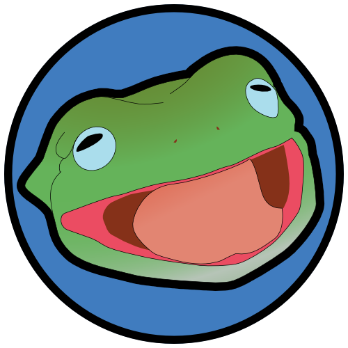

# FrogDAO

An experiment to govern very crucial decisions like "What should [Frogmonkee](https://twitter.com/frogmonkee?ref_src=twsrc%5Egoogle%7Ctwcamp%5Eserp%7Ctwgr%5Eauthor) wear on his next date?". The project will live on Polygon chain.

## Setup

1. `git pull  https://github.com/PradhumnaPancholi/FrogDAO.git`
2. `cd FrogDAO`
3. `npm install`
4. `npm test (for running tests)` 
5. `npm run compile`

## Tools and languages

1. Hardhat
2. Solidity
3. TypeScript

